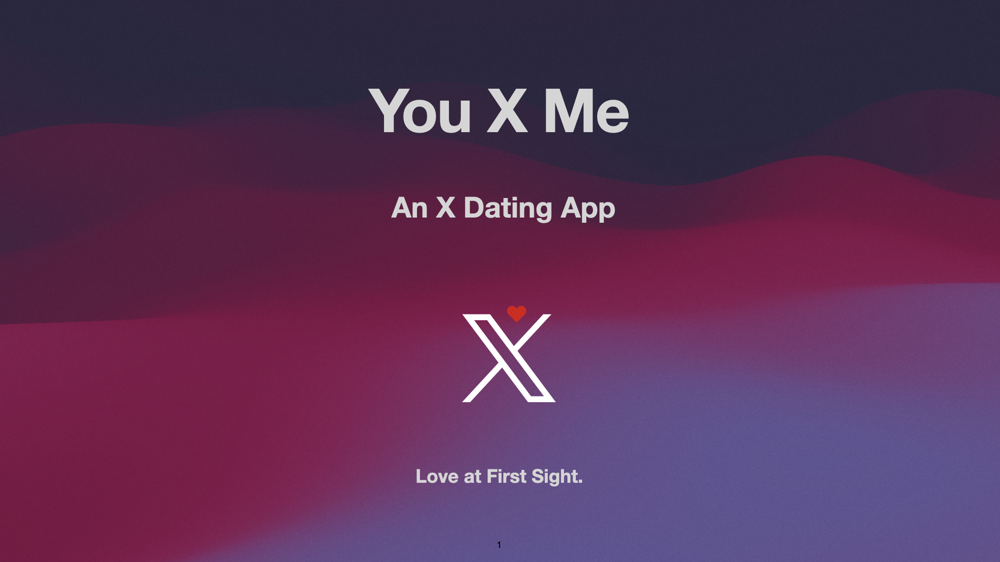
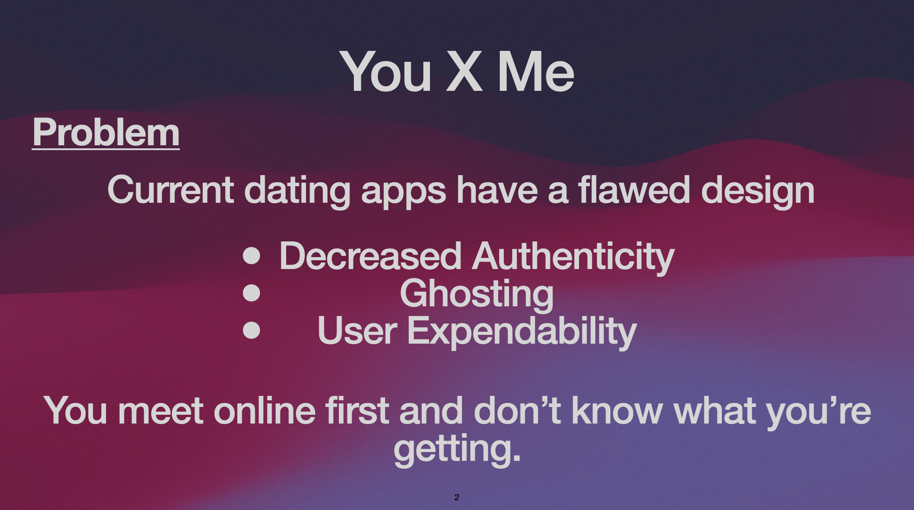
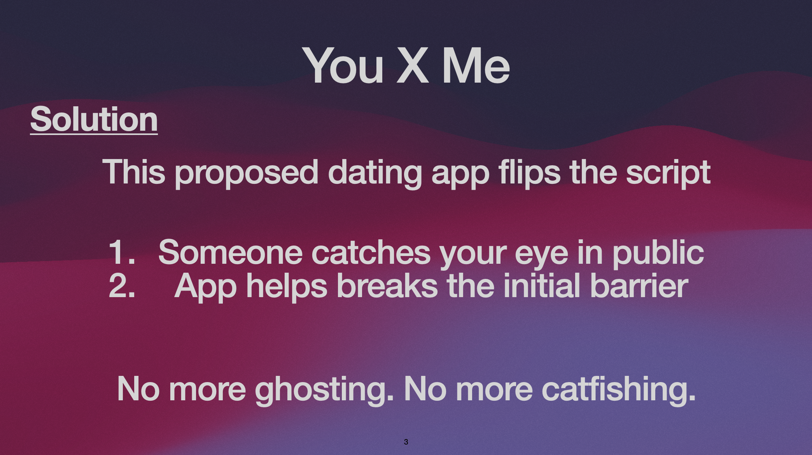
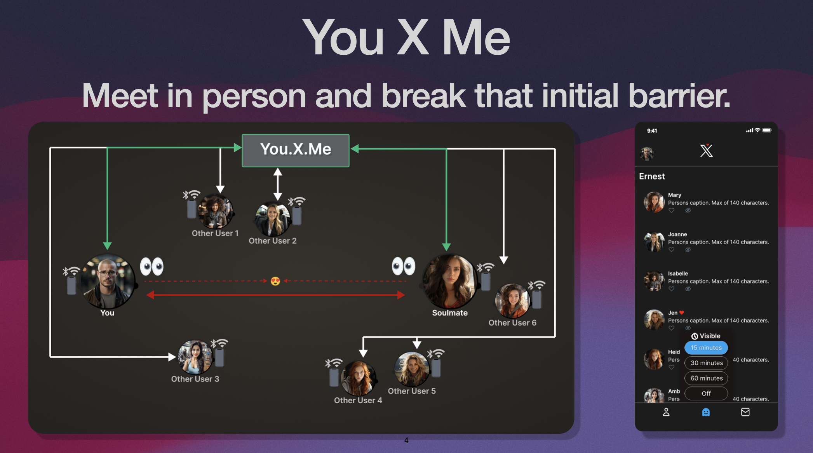
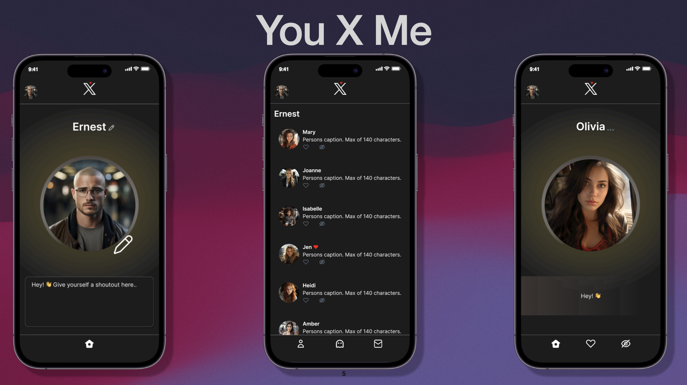
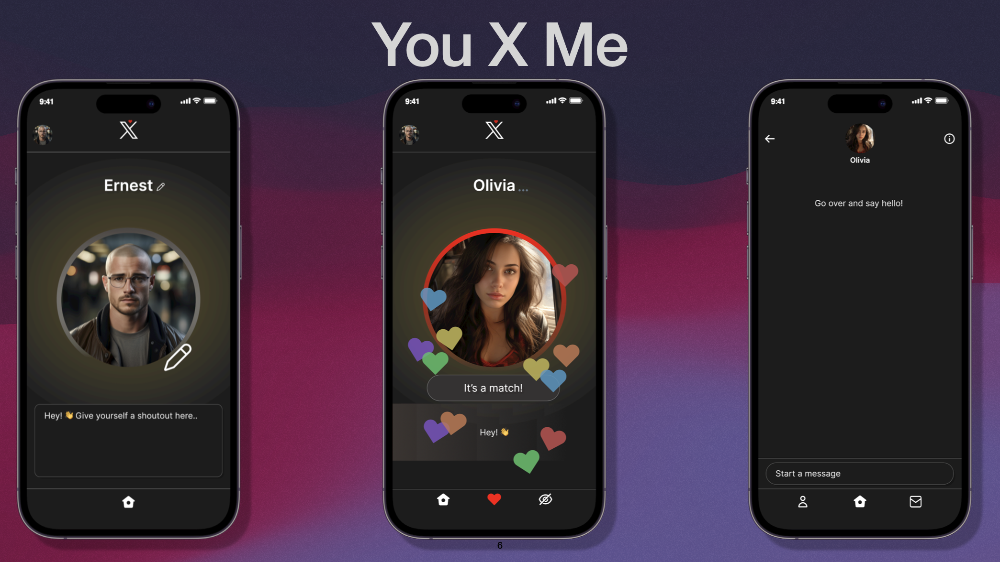

# YouXMe - An X Dating App.

## App Title & Motto

App Title: “You X Me”

*(You and Me)*

## Challenges with Current Dating Apps

Existing dating apps inherently trivialize matches due to selection overload and by reducing individuals to mere images and brief text, fostering a sense of detachment. A real connection is difficult to make under these conditions.

## Solution

“You X Me” offers a simple solution: facilitate connections in real life settings (such as coffee shops, gyms, classrooms, weddings, etc.) by helping overcome initial social barriers.

Let's illustrate how the app works with a short story:
Imagine a young man named Ernest living in New York City. One day, Ernest finds himself in the lively hum of a bustling city setting- perhaps a restaurant, a classroom, a busy gym, or even a crowded airport. Amidst the activity, his attention is subtly captured by an elegant woman named Olivia. A fleeting exchange of glances occurs, but circumstances or nerves make it difficult for him to approach her. Ernest wonders, "Should I disturb her peace?”. Opting to avoid potential embarrassment or imposition, he continues with his day, leaving the possibility of connection unexplored. Unbeknownst to him, Olivia too was interested but found the situation equally daunting.

## App Overview

How would the app work? “You X Me” would utilize Bluetooth/WiFi technology to allow the app to see nearby users and interact or “like” them.

To illustrate this functionality let's use our earlier scenario. In a world where both Ernest and Olivia are users of “You X Me”, they would both have the option to make themselves visible to nearby users on the app. If they found each other interesting, and see each other in the app, they would be able to express their interest by “liking" each other's profiles. The benefit of this system is in its discretion - notifications are only sent when the interest is mutual, ensuring a pressure-free experience. This way, the app facilitates a connection that might have otherwise been a missed opportunity, while still preserving the spontaneity of real-life encounters.

## Main Screens

This slide displays three important screens of the proposed app. From left to right:

1. Ernest’s profile (the view you’d see as a user of the app to modify your profile).
2. A main screen where you are able to see nearby users that have chosen to be visible to you or nearby users for a brief time (i.e. 30 minutes). Ernest is able to see nearby visible users on the app because he is himself visible. 
3. A view of the profile Ernest is interested in, Olivia’s profile.

## Matching

When Ernest and Olivia have liked each other. From left to right:
1. Ernest’s profile.
2. A view (from Ernest's perspective) after Olivia has liked Ernest, and then Ernest has liked Olivia, notifying Ernest of the match!
3. A view of Ernest and Olivia being able to message or simply interact in person.